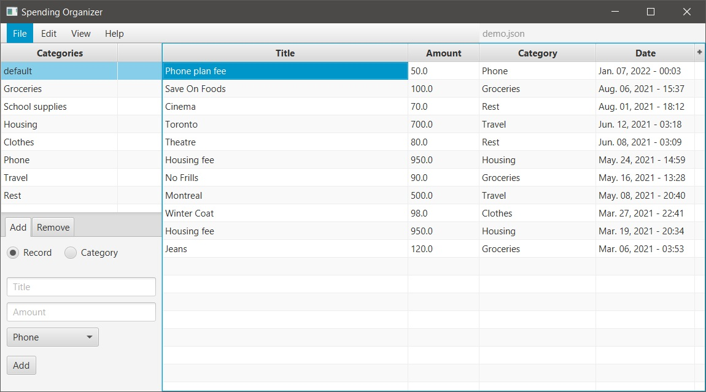
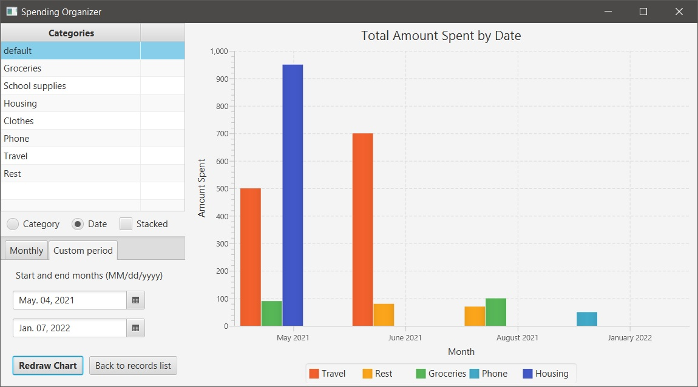
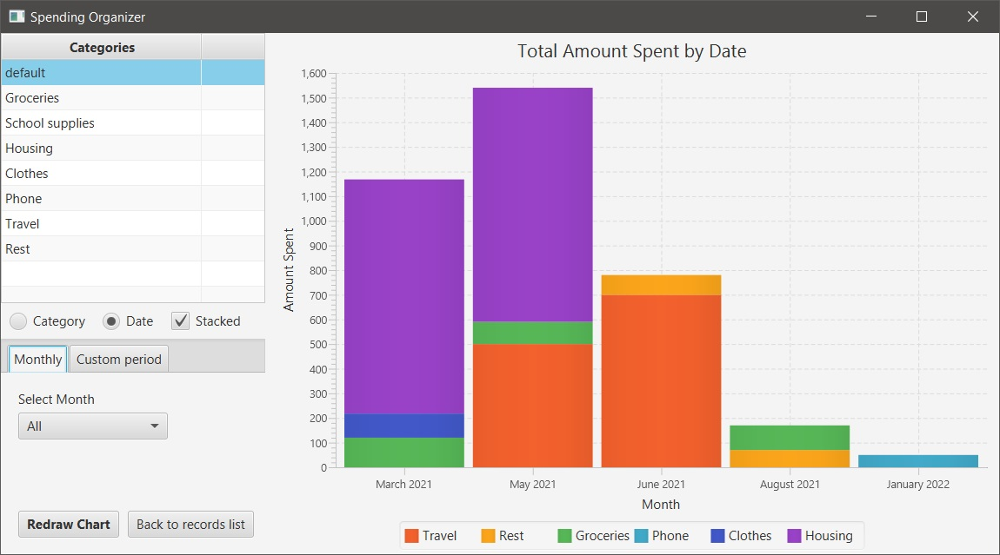

# Spending Organizer

### What does the application do?
It allows users to store and categorize their spending. Users can add spending records to a list and refer to it later to check how much they spend every month. Spending record consists of "Title", "Amount Spent", and "Category of spending" (e.g. "Went to NoFrills" | 70 CAD | Groceries).

Additionally, users can sort records by all their attributes and create bar charts to visualize the expenses.

<figure>
    
    <figcaption>Bar chart showing records created in a specific time period</figcaption>
</figure>
<figure>
    
    <figcaption>Stacked bar chart showing all records</figcaption>
</figure>

### How to run
1. `java -version`: has to be Java 8
2. `git clone https://github.com/Ihor16/Spending-Tracker.git`
3. `java -jar ./artifacts/Project_Starter_jar/Project-Starter.jar`

### Project Stages
Read more [here](./docs/project-stages.md)